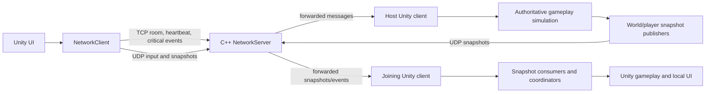

# Golden Sand Caravan Networking Architecture

## Scope

Golden Sand Caravan uses one Unity client project and an independent C++17
Windows server. Phase 8 documents and packages the existing implementation;
it does not add gameplay features.

## Components

- **Unity client**: menus, gameplay presentation, local input, local UI, and
  the authoritative simulation when the client is the room host.
- **NetworkServer**: Winsock2 TCP/UDP transport, room membership, player IDs,
  session tokens, message forwarding, heartbeat handling, and disconnect
  detection. It does not simulate combat.
- **NetworkClient**: C# protocol and transport facade. TCP/UDP receive threads
  only handle bytes and enqueue events; Unity objects are touched on the main
  thread by `NetworkClientBehaviour`.
- **NetworkGameBootstrap**: chooses single-player, host, or client setup and
  connects gameplay adapters, registries, snapshot publishers, consumers, and
  coordinators.

## Authority

| State | Authority | Transport |
| --- | --- | --- |
| Room membership and player mapping | C++ server | TCP |
| Local/remote player input forwarding | Sending client and server routing | UDP |
| Player movement, aim, shots and skills | Host Unity client | UDP snapshots/events |
| Enemy, Boss, projectile and experience simulation | Host Unity client | UDP snapshots; TCP events |
| Player health, max health and death | Host Unity client | UDP state; TCP death/result confirmation |
| Shared experience and upgrade completion | Host Unity client | TCP/UDP state messages |
| Final victory/defeat result | Host Unity client, confirmed to client | TCP |

The joining client applies authoritative state by stable entity/player ID. It
does not independently decide damage, death, enemy spawning, or final results.

## Data Flow

## Runtime Modes

- **Single player**: one local player is created; no socket, server process,
  watchdog, or network coordinator is started.
- **Host**: the host creates both player representations when a room has two
  players, simulates both players and the world, and publishes state.
- **Joining client**: the client creates local and remote representations,
  sends its input, and applies host snapshots/events. The camera follows only
  the local player.

## Phase 6 and 7 Integration

Phase 6 added stable world entities, enemy/Boss/experience synchronization,
shared experience, upgrade coordination, authoritative player health, and the
local `HealthBarView`. The local health bar listens to `PlayerHealth`; it does
not parse network packets and never displays a remote player's head-up bar.

Phase 7 added heartbeat and timeout detection, disconnect policy, disconnect
dialogs, host gameplay pause while a decision is pending, cleanup of players
and world entities, and `NetworkShutdownCoordinator`. Shutdown is idempotent:
subscriptions, queues, sockets, threads, and owned server processes are
released once.

## Explicit Non-goals

There is no reconnect flow and no host migration. A host disconnect ends the
room for the joining client. A joining-client disconnect lets the host choose
to continue as single player or return to the menu.
